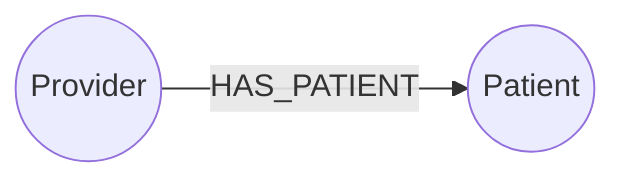
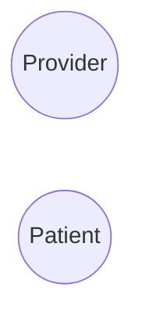
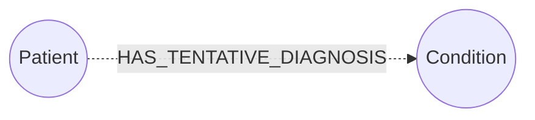
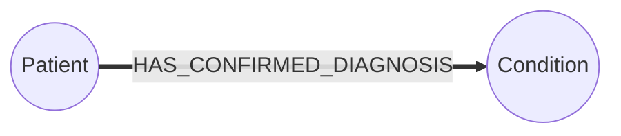

# Graph Basics
We will generate the basic elements of a labeled property graph:



1. Round circles for vertices
2. Labeled edges

We will use the following conventions:

1. Vertices use UpperCamelCase
2. Edge labels use UPPER_CASE_WITH_UNDERSCORES

Our graphs will use a Left-to-Right orientation.  Other [layout options](https://mermaid-js.github.io/mermaid/#/flowchart?id=flowchart-orientation) you can use are:

* **LR** - for Left-to-Right orientation
* **TD** or **TB** - for Top-Down Top to Bottom orientation
* **BT** - bottom to top
* **RL** - right to left

Each of our drawings begin with the keyword ```graph``` and the automatic layout algorithm.  So for graphs with Left-to-Right layouts we start our drawing with:

```graph LR```

## Vertex Circles
There are [many shapes](https://mermaid-js.github.io/mermaid/#/flowchart?id=nodes-amp-shapes) you can make a node in a graph.  For our high-level graph data models we will stick to circles which we indicate by surrounding a Vertex Label with double parenthesis ```((`` and ```))```.

```
graph LR
     id1((Provider))
     id2((Patient)
```



## Labeled Directed Edges
Now let's add a directed edge with a label on it between the two vertices.  We will do this by adding one addition line between the two vertex statements.  The line must start with a double dash and end with a dash-dash-greater-than character like this:

Here is the labeled directed edge line:

```
-- HAS_PATIENT -->
```

The Mermaid documentation calls this [text-on-link](https://mermaid-js.github.io/mermaid/#/flowchart?id=text-on-links)


```
graph LR
    id1((Provider))
    -- HAS_PATIENT -->
    id2((Patient))
```


You can also remove the greater than ```>``` in the link to make the link an undirected edge.  There are other [link options](https://mermaid-js.github.io/mermaid/#/flowchart?id=links-between-nodes) you can use such as a dotted link.





