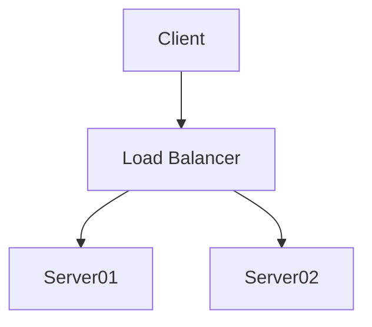

# Mermaid Drawing Test

## Simple Left to Right flowchart using "LR"
This is a simple example to show you how to get started with the Mermaid drawing extension to mkdocs.  Within your Markdown (.md) file you will place three backslash characters followed by
the ```mermaid``` keyword on the first line.

```
graph LR
    Start --> Stop
```


## With Labels and Node IDs
Here is this same left-to-right workflow with a vertex ID and a label using the ```ID[MyLabel]``` syntax.

```
graph LR
    A[Start] --> B[Stop]
```


