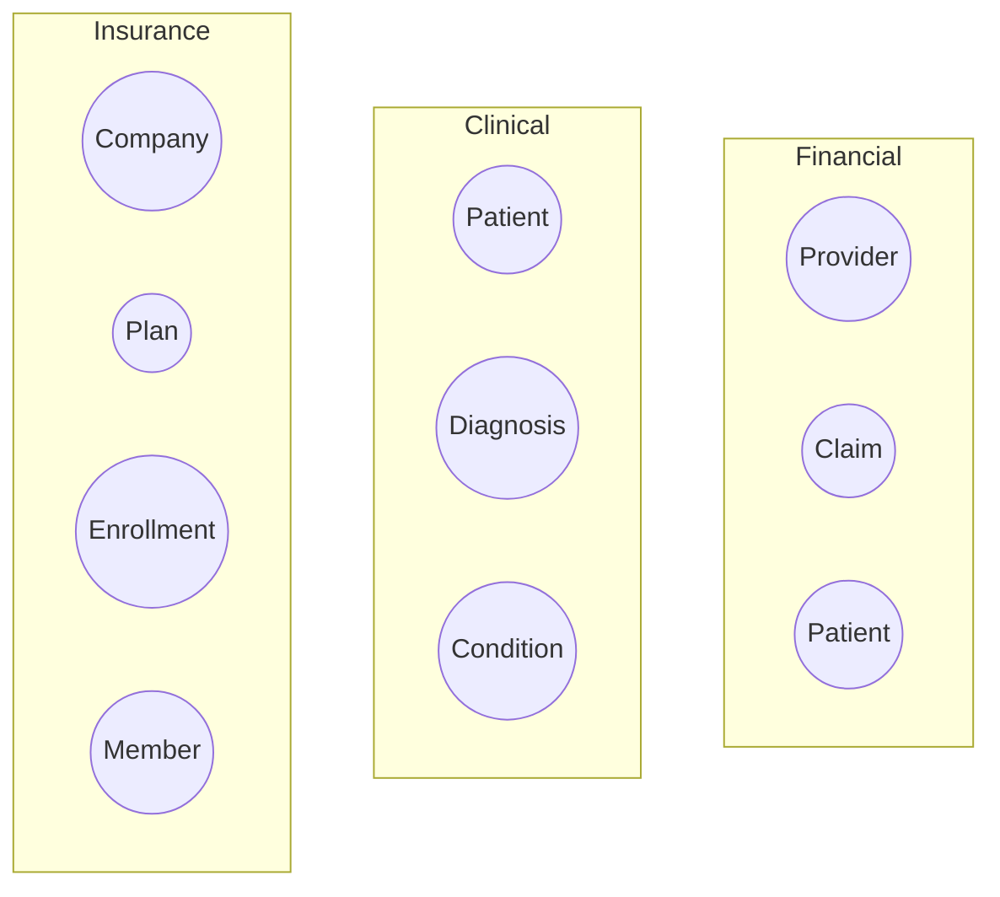
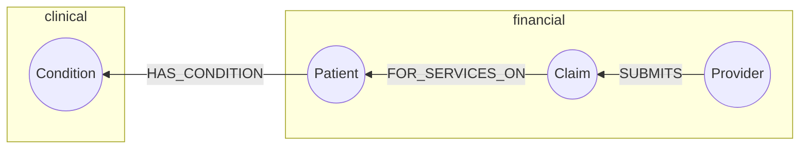

# Subgraphs
You can partition complex graphs into subgraphs.  For example here are three separate subgraphs from the healthcare domain.




Here is the code to render this graph:

```
graph TD
    subgraph Financial
        id1((Provider))
        id2((Claim))
        id3((Patient))
    end
    subgraph Clinical
        id4((Patient))
        id5((Diagnosis))
        id6((Condition))
    end
    subgraph Insurance
        id7((Company))
        id8((Plan))
        id9((Enrollment))
        id10((Member))
    end
```



